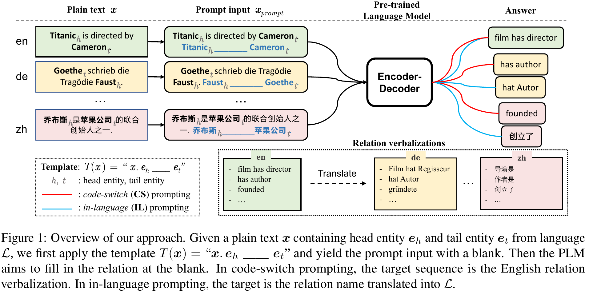
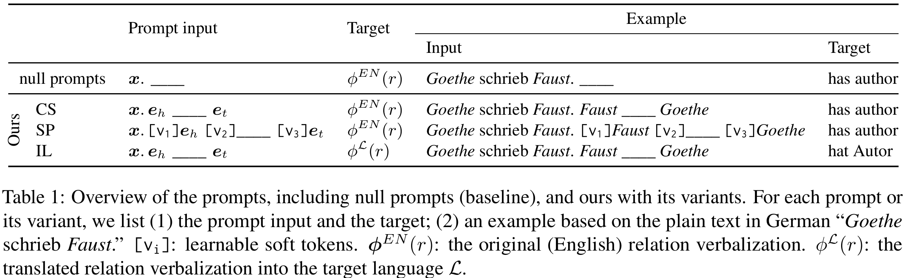

# MEffi-Prompt
The repository for our paper ***Multilingual Relation Classification via Efficient and Effective Prompting***, to appear at **EMNLP-2022** (main conference).




## Table of Contents
- [Overview](#-overview)
- [Installation](#-installation)
- [Usage](#-usage)
- [Prompt Construction](#-prompt-construction)
- [Dataset](#-dataset)
- [Citation](#-citation)
- [License](#-license)


## 🔭&nbsp; Overview
|**Path**|**Description**|
|---|---|
|[config/](./config/)|This directory contains the Hydra config files that specify pre-defined settings.|
|[data/](./data/)|This directory where the user should put their data files, as well as some pre-processing scripts.|
|[docs/](./docs/)|This directory contains the auxiliary files for documentation, such as the figure(s)presented in README.|
|[src/meffi_prompt/](./src/meffi_prompt/)|This directory is the package to be installed, which contains the source code of our implementation.|


## 🚀&nbsp; Installation
```bash
git clone git@github.com:DFKI-NLP/meffi-prompt.git
cd meffi-prompt
pip install -e .
```


## 💡&nbsp; Usage
To evaluate the default setting (i.e. fully supervised scenario with `model="google/mt5-base", max_length=256, batch_size=16, num_epochs=10, lr=3e-5, soft_token_length=0`), run:
```bash
python main.py
```

To run your own setting:
```bash
python main.py model="google/mt5-small" batch_size=4 num_epochs=5
```

Hydra provides a simple way to sweep the arguments for hyperparameter-finetuning. The following command will excute 3 * 2 * 1= 6 runs in a row:
```
python main.py -m batch_size=4,8,16 model="google/mt5-base","google/mt5-small" max_length=512
```

To show the available options and the default config, do:
```bash
python main.py --help
```
which results in something like this:

```
== Config ==
Override anything in the config (foo.bar=value)

seed: 1234
cuda_device: 0
train_file: ./data/smiler/de_corpora_train.json
eval_file: ./data/smiler/de_corpora_test.json
model: google/mt5-base
soft_token_length: 0
max_length: 256
batch_size: 16
lr: 3.0e-05
num_epochs: 5
```


## 🔎&nbsp; Prompt Construction


The templates we employ (see the table above) are already in the code, so it involves no work from your side to reproduce our results.

You can also define your own template. For example, if you want the template to be *"$x$. The relation between $e_h$ and $e_t$ is _____.*, just modify the prompt as
```python
template = {
    "input": ["x", "The relation between", "eh", "and", "et", "is", "<extra_id_0>"],
    "target": ["<extra_id_0>", "r", "<extra_id_1>"],
}
```
where $x$, $e_h$, $e_t$, $r$ are variants, and `<extra_id_?>` are special tokens preserved by T5 to denote either (1)start of a blank or (2) end of decoded sequence. The rest elements are hard tokens. To insert soft tokens, use `[vN]` (`v` means virtual token; `N` is the length of inserted soft tokens and can be specified in config.)


## 📝&nbsp; Dataset
We evaluate the [SMiLER](https://aclanthology.org/2021.eacl-main.166/) dataset which covers 14 languages. The dataset can be downloaded from [https://github.com/samsungnlp/smiler](https://github.com/samsungnlp/smiler). The pre-processing script is at `./data/smiler/reformatter.py`.


## 📚&nbsp; Citation
```
@inproceedings{chen-etal-2022-multilingual,
    title = "Multilingual Relation Classification via Efficient and Effective Prompting",
    author = "Chen, Yuxuan and Harbecke, David and Hennig, Leonhard",
    booktitle = "Proceedings of the 2022 Conference on Empirical Methods in Natural Language Processing",
    month = december,
    year = "2022",
    address = "Online and Abu Dhabi, UAE",
    publisher = "Association for Computational Linguistics",
    abstract = "Prompting pre-trained language models has achieved impressive performance on various NLP tasks, especially in low data regimes. Despite the success of prompting in monolingual settings, applying prompt-based methods in multilingual scenarios has been limited to a narrow set of tasks, due to the high cost of handcrafting multilingual prompts. In this paper, we present the first work on prompt-based multilingual relation classification (RC), by introducing an efficient and effective method that constructs prompts from relation triples and involves only minimal translation for the class labels. We evaluate its performance in fully supervised, few-shot and zero-shot scenarios, and analyze its effectiveness across 14 languages, prompt variants, and English-task training in cross-lingual settings. We find that in both fully supervised and few-shot scenarios, our prompt method beats competitive baselines: fine-tuning XLM-R_EM and null prompts. It also outperforms the random baseline by a large margin in zero-shot experiments. Our method requires little in-language knowledge and can be used as a strong baseline for similar multilingual classification tasks.",
}
```


## 📘&nbsp; License
This repository is released under the terms of the [Apache 2.0](./LICENSE) license.
